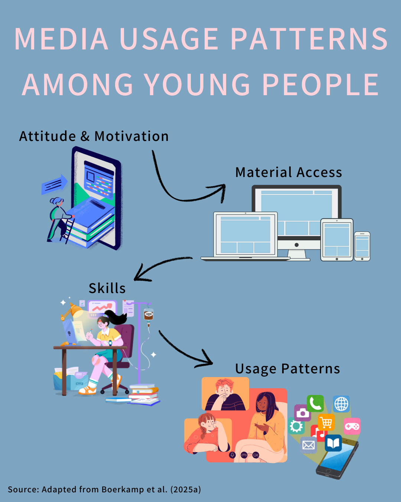
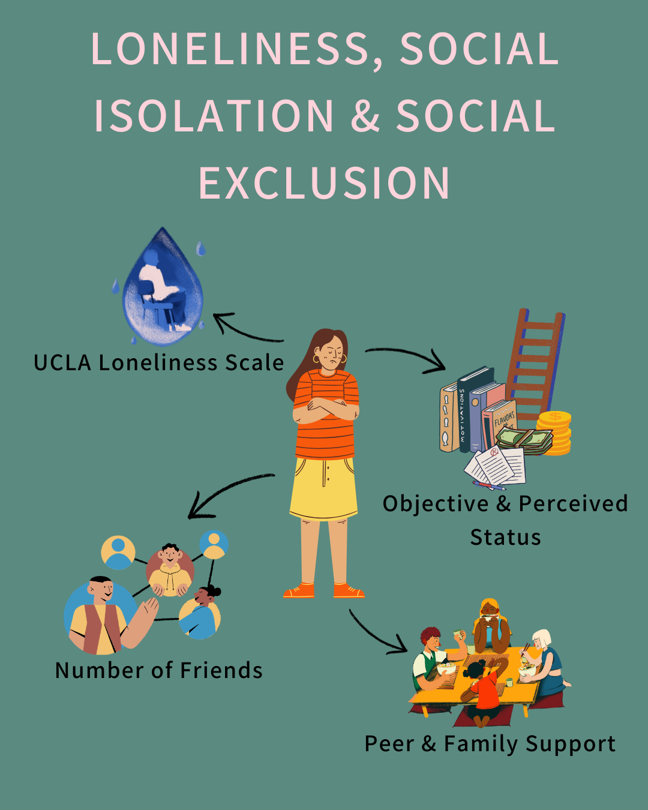
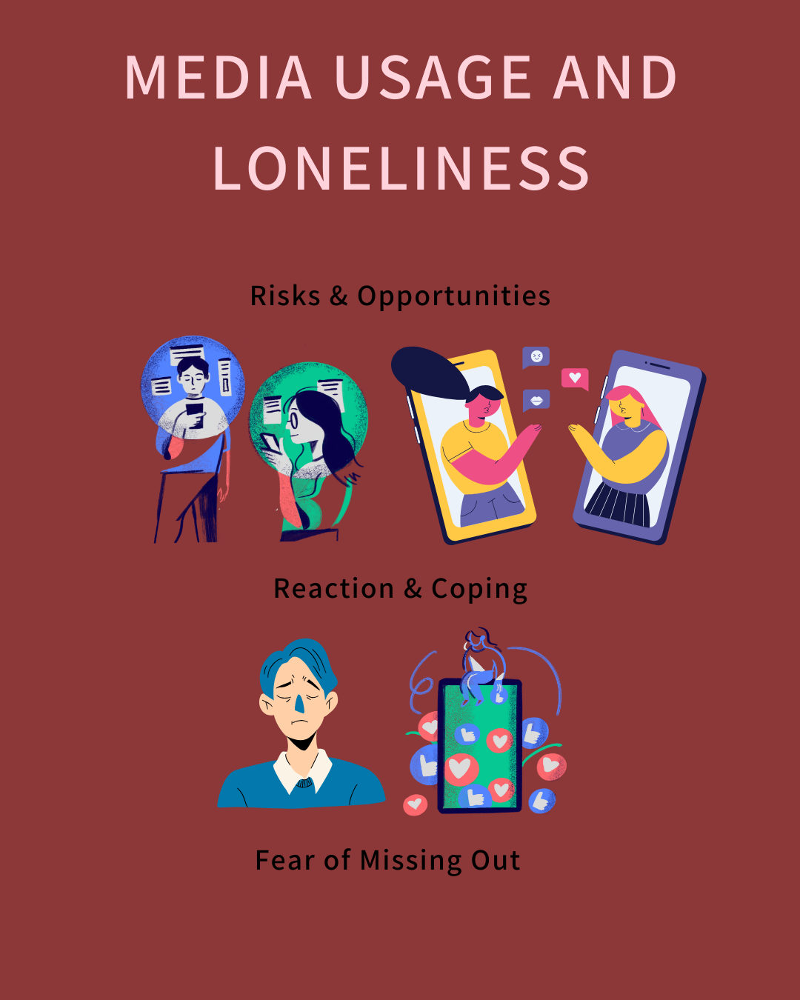

Loneliness, social isolation, and social exclusion are significant challenges in our society as they can be major contributors to many mental and physical health [problems](https://www.nature.com/articles/s41572-022-00355-9). The issue of loneliness has been brought to the public's attention by the pandemic, as many people have had to give up social interactions because of containment measures. So far, social science research on loneliness has mainly focused on older people, while there is limited research on feelings of loneliness, social exclusion and isolation among adolescents and young adults ([Verity](https://durham-repository.worktribe.com/output/1208841/loneliness-from-the-adolescent-perspective-a-qualitative-analysis-of-conversations-about-loneliness-between-adolescents-and-childline-counsellors) et al., 2022). My PhD project aims to fill this research gap and develop a better understanding of loneliness in young people, including the influence of media use. The impact of technology and social media on social isolation is an ongoing area of research that is constantly evolving. Studies have shown that excessive use of social media can have negative effects on the health of young people, but the use of social media is one of the main channels of communication. On the other hand, social media communication has an impact on real life relationships. In order to identify risks and opportunities, I would like to better understand this process. This leads to my research question:

*What impact do inequalities in access to, use of and outcomes from (social) media have on social exclusion, social isolation, and loneliness?*

I have broken down my PhD project into three work packages based on the research question. Each of these will be examined using specific methods and published as individual papers (hopefully). You can find out more about my PhD project on my department's [website](https://www.youth-in-luxembourg.lu/project/loneliness-social-isolation-and-social-exclusion-inequalities-in-access-use-and-consequences-of-social-media/) or by checking out this [interview](https://www.youth-in-luxembourg.lu/we-should-know-more-about-loneliness-among-young-people-in-luxembourg/).

## Media Usage Patterns among young People

{fig-align="center" width="300"}

This study investigates how digital media usage differs among young people in a high-income country, using Luxembourg as a case study. Despite near-universal internet access and an advanced digital infrastructure, persistent disparities in digital engagement remain. Drawing on the Resources and Appropriation Theory and Digital Divide Theory, this research explores whether digital inequalities—particularly in attitudes, skills, and usage—exist even when material access is nearly universal.

Using data from the 2024 [Youth Survey Luxembourg](https://www.youth-in-luxembourg.lu/project/youth-survey-luxembourg-ysl/), a Latent Class Analysis is conducted to identify distinct patterns of digital media usage among youth aged 16 to 29. Findings are expected to reveal that, despite high levels of connectivity, differences in digital skills, motivations, and usage persist and are shaped by structural inequalities.

This study contributes to the growing field of digital inequality research by shifting the focus beyond access to explore how social and economic factors influence deeper levels of digital engagement. The results offer important implications for policy aimed at promoting digital inclusion and ensuring equitable opportunities for young people in digitally advanced societies.

## Loneliness, social Isolation, and social Exclusion

{fig-align="center" width="300"}

Loneliness, social isolation and social exclusion are closely related yet distinct concepts that are key to understanding social cohesion and political participation. Loneliness is the subjective experience of unmet social needs; social isolation is an objective lack of social contact; and social exclusion is structural and relational barriers to participation. While existing research has largely focused on adults and older populations, children, adolescents and young adults, despite reporting high levels of loneliness, remain understudied. This is a critical gap, as adolescence and early adulthood are key life phases marked by educational transitions, changing peer relations, and increasing independence, which can make people more vulnerable to loneliness, with potentially long-lasting consequences.

Using data from the 2024 [Youth Survey Luxembourg](https://www.youth-in-luxembourg.lu/project/youth-survey-luxembourg-ysl/) (ages 12-29), this study examines the interplay between loneliness, social isolation, and social exclusion. Loneliness is measured using an adapted 4-item UCLA scale, social isolation through indicators of friendships and peer and family support, and social exclusion via both objective (e.g. family affluence, cultural socio-economic status) and subjective status measures.

Social isolation is a strong predictor of loneliness. Unexpectedly, a higher cultural and socio-economic status, as well as a higher perceived family status, are associated with greater loneliness. In contrast, a higher subjective evaluation of one's own life reduces loneliness. Together, these findings highlight the importance of considering structural, relational and subjective dimensions when addressing loneliness among young people.

## Media Usage and Loneliness

{fig-align="center" width="300"}

In my last paper, I would like to combine both perspectives and explore the question of how loneliness and media use are related. The aim is to identify risks and opportunities. On the one hand, media use can provide opportunities to meet new people with similar interests and maintain communication with friends. On the other hand, the process of comparison, especially on social networks, can trigger feelings of FoMo (fear of missing out) and increase feelings of stress and loneliness. Data from the [Youth Survey Luxembourg](https://www.youth-in-luxembourg.lu/project/youth-survey-luxembourg-ysl/) 2024 will be used for this analysis. The results should contribute to a more differentiated understanding of media use and its effects.