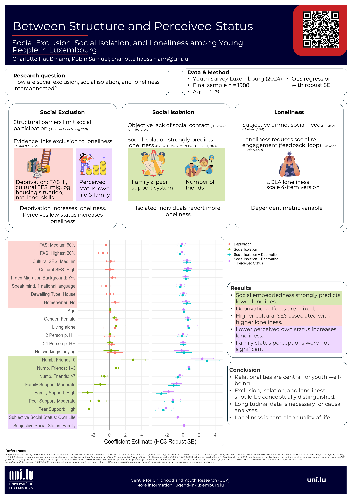

# Between Structure and Perceived Status

## Social Exclusion, Social Isolation, and Loneliness among Young People in Luxembourg

**Authors**: Charlotte Haußmann, Robin Samuel\
University of Luxembourg

You can download the poster [here](pdf/Poster_Colloquium_v1.pdf).

+-------------------------------------------------------+--------------------------------------------------+
| {fig-align="center" width="300"}| Audio Presentation                               |
|                                                       |                                                  |
|                                                       | <audio controls>                                 |
|                                                       |                                                  |
|                                                       | <source src="audio/poster_presentation.mp3"      |
|                                                       |   type="audio/mpeg">                             |
|                                                       | Your browser does not support the audio element. |
|                                                       | </audio>                                         |
+-------------------------------------------------------+--------------------------------------------------+

